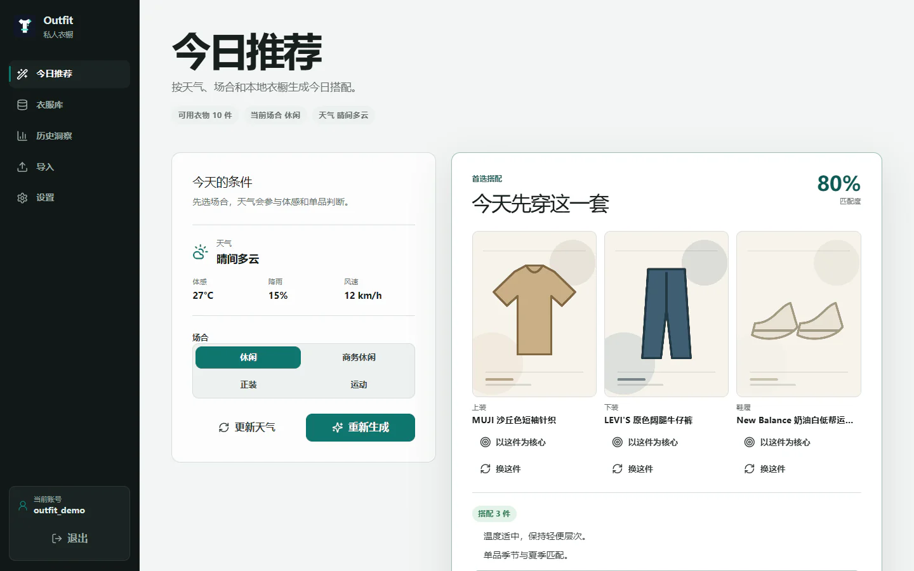
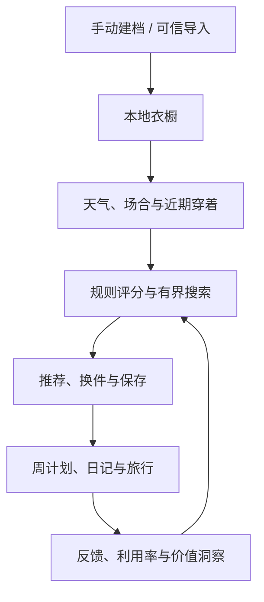
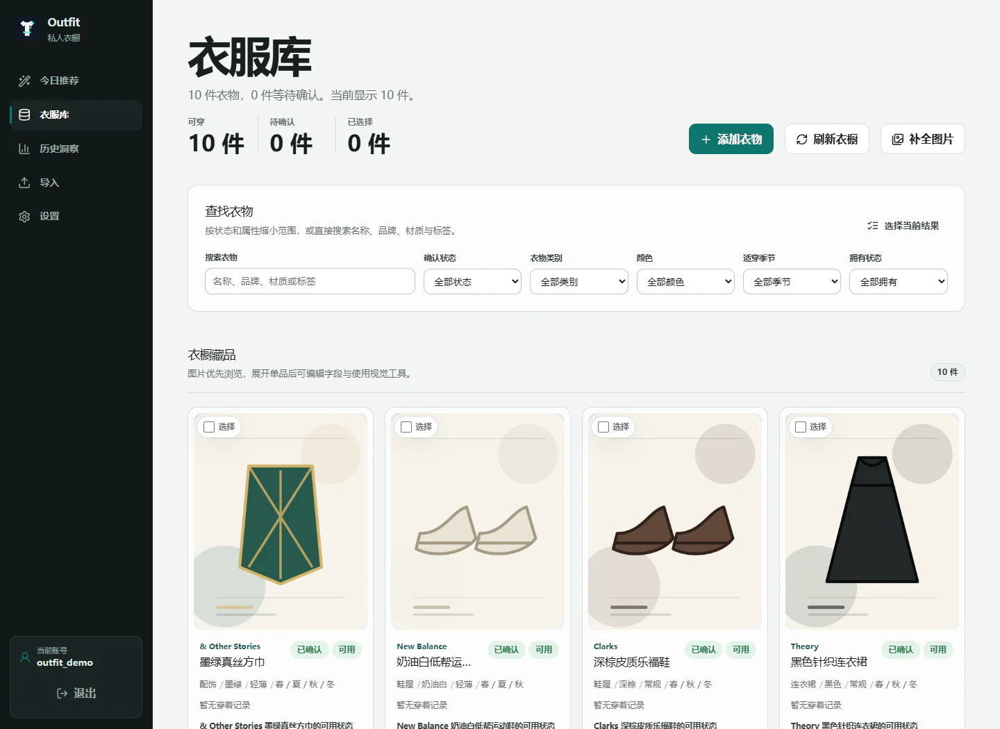
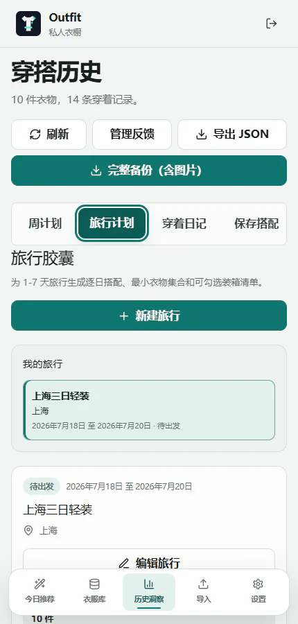
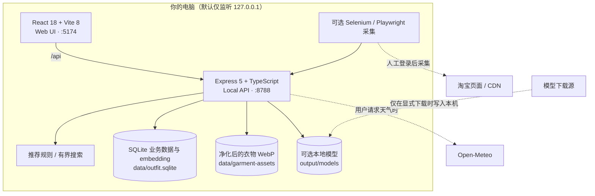

<p align="center">
  
</p>

<h1 align="center">Outfit</h1>

<p align="center">
  <strong>把“衣服很多，却不知道今天穿什么”变成一个本地、可解释、能持续学习的决策流程。</strong>
</p>

<p align="center">
  本地优先 · 可解释推荐 · 衣橱管理 · 穿着日记 · 旅行胶囊
</p>

Outfit 是一款面向个人使用的本地衣橱与穿搭决策应用。它把衣物建档、可信导入、天气与场合推荐、换件反馈、周计划、穿着记录、价值洞察、购买前检查和旅行装箱串成一个完整闭环。核心推荐与旅行规划由确定性规则和有预算上限的搜索完成，不依赖云端生成式 AI。



> 截图来自当前代码运行出的隔离演示环境；账号、衣物、穿着记录和行程均为虚构数据，服饰图由本地几何插画生成。画面中的品牌名只作界面演示，不表示合作、授权或背书。

---

## 目录

- [Outfit 解决什么问题](#overview)
- [真实界面](#screenshots)
- [核心能力](#capabilities)
- [系统架构](#architecture)
- [快速开始](#quick-start)
- [可选能力：淘宝采集与本地视觉](#optional)
- [推荐与旅行规划如何工作](#algorithms)
- [数据、安全与网络边界](#privacy)
- [开发、测试与项目结构](#development)
- [文档与已知边界](#docs-and-limits)

<a id="overview"></a>

## Outfit 解决什么问题

衣橱应用通常停在“把衣服录进去”。Outfit 更关注录入之后的决策：今天的天气和场合适合什么、怎样避免连续重复、为什么这套排在前面、临时换掉一件后还有什么选择、这件衣服是否真的值得继续保留，以及三天出行怎样用更少的衣服覆盖更多活动。

| 你的问题 | Outfit 的回答方式 |
|---|---|
| 今天穿什么？ | 结合本地衣橱、天气、场合、季节、正式度、近期穿着与显式反馈生成可解释候选。 |
| 推荐里有一件不想穿？ | 保留搭配上下文，在同类别可用衣物中换件，并记录原因。 |
| 哪些衣服一直闲置？ | 用穿着日记、利用率、成本/次、色彩和类别分布呈现衣橱洞察。 |
| 新衣服是否值得买？ | 用候选商品的结构字段查找已有相似衣物，再结合可复用的保存搭配与衣橱覆盖缺口提供购买前证据。 |
| 下周或旅行怎么安排？ | 保存搭配进入周计划；旅行模块为 1–7 天活动生成逐日方案、胶囊集合与装箱清单。 |
| 数据会被上传吗？ | 业务数据库、衣物图片和可选视觉模型默认保存在本机；天气、淘宝页面/远程图片、缩略图本地化、模型或依赖下载会按用户动作访问对应外部服务。 |

### 从录入到复盘的闭环



<a id="screenshots"></a>

## 真实界面

### 衣服库

[](docs/readme-assets/wardrobe-desktop.webp)

<p align="center"><sub>图片优先浏览、组合筛选、状态与可用性管理</sub></p>

### 旅行胶囊 · 移动端

<p align="center">
  <a href="docs/readme-assets/trip-mobile.webp">
    
  </a>
</p>

<p align="center"><sub>三日行程、胶囊入口与响应式五项导航；二级分区可横向滚动</sub></p>

界面采用固定五项主导航：**今日推荐、衣服库、历史洞察、导入、设置**。周计划、旅行计划、穿着日记、保存搭配和洞察位于“历史洞察”的二级导航中；窄屏会切换为移动头部与底部导航。

### 一分钟启动

核心功能只需要符合版本要求的 Node.js。在已经检出的仓库根目录执行：

```powershell
npm ci
npm run dev
```

然后打开 <http://127.0.0.1:5174>。首次访问会引导创建本机唯一账号；完整环境、端口和命令说明见[快速开始](#quick-start)。

<a id="capabilities"></a>

## 核心能力

### 1. 可信录入与衣橱治理

- 手动创建衣物，记录类别、颜色、季节、风格、正式度、保暖度、材质、图案、品牌、尺码、价格和备注等信息。
- 支持淘宝订单/商品 JSON 的“预览 → 审核 → 提交”流程；退款、非服饰、身份冲突和疑似重复不会被静默吞掉。
- 浏览器采集任务在可见 Chrome 中运行，保留人工登录、滑块和风险验证环节；这不是淘宝官方 API。
- 上传图片由服务端解码、校验并重新编码为本地 WebP，客户端只接触受控资源 URL，不暴露物理存储路径。
- 衣物可设为可用、洗涤中、借出、维修中或已装箱；还可确认、排除、归档和恢复。

### 2. 可解释的今日推荐

- 使用当前可用衣物、场合、天气、季节、个人画像、近期穿着和组合反馈生成搭配。
- 每个候选保留稳定快照、分项得分、选择理由和降分原因，刷新历史衣物不会改写旧推荐的解释。
- 支持指定必须包含/排除的衣物、在同类别中换件、保存搭配、安排到某天和提交“实际穿了什么”。
- 反馈只在有足够证据时以有界权重调整排序，不会覆盖硬约束，也不会把偏好包装成不可解释的黑盒结论。

### 3. 保存搭配、周计划与穿着日记

- 可以手工创建、编辑搭配，也可把推荐候选保存为可收藏、可归档的搭配；换件会创建派生版本并保留来源关系。
- 7 天周计划使用用户时区中的本地日历日期，实际穿着时间单独保存为 UTC 时间戳。
- 正式场合、约会或晚餐的近期重复会提示，但计划已经保存的事实不会被提示对话框撤销。
- 日记支持补录、修改、删除、天气快照、备注和稳定分页；计划标记“已穿”与日记写入在同一事务完成。

### 4. 洞察、价值与购买前检查

- 汇总穿着次数、长期闲置、颜色/类别分布、最近活动和衣物利用情况。
- 在成本证据可靠时计算成本/次；手工价格优先，淘宝成本只在数量与实付款都明确且未退款时推导。
- 购买前检查用候选的类别、颜色、风格、材质、图案、品牌和名称等结构字段查找同类相似衣物，并结合可复用的已保存搭配与类别、季节、正式度覆盖缺口提供决策证据。
- 可选的本地 CLIP 向量只增强已有衣物之间的相似查询；淘宝候选当前不会生成视觉向量。没有模型或缓存时仍可使用结构化字段，查询不会自动下载模型。

### 5. 旅行胶囊与装箱清单

- 为 1–7 天旅行保存目的地、日期、每日活动、场合、衣物/鞋履上限、重复规则和可选洗衣日。
- 为每个活动生成逐日搭配，并计算覆盖行程的衣物胶囊；支持锁定单品、同类别替换和从目标日向后局部重算。
- 不可行时返回冲突约束与放宽建议；只有经过同一优化器重新验证的建议才可一键应用。
- 装箱项支持“未装箱、已打包、穿在身上、不带”四种状态，并展示覆盖日期、活动和选择理由；非衣物必需品可自由添加。
- 完成旅行前必须逐套确认实际穿着；同一套可以覆盖多个共用活动。系统不会把计划自动当成事实，也不会改变衣物的全局可用状态。

### 6. 导出与可迁移证据

- JSON 导出包含版本化业务数据和资产元数据，但不内嵌图片、绝对路径、密码、会话或可重建的视觉向量。
- ZIP 导出额外流式写入 `garment_assets` 中校验通过的衣物 WebP；不包含远程缩略图、抠图、模型、天气缓存、采集任务、浏览器 profile 或登录态。
- 当前没有恢复导入 API，因此导出包是可检查的数据副本，**不是已经具备一键恢复能力的完整灾备方案**。

<a id="architecture"></a>

## 系统架构



### 技术栈

| 层 | 主要技术 | 职责 |
|---|---|---|
| Web | React 18、TypeScript strict、Vite 8、Tailwind CSS 4 | 响应式交互、可访问状态、服务端 API 客户端 |
| API | Express 5、Helmet、TypeScript/tsx | 会话门禁、严格输入、业务编排、资源流式输出 |
| 数据 | Node `node:sqlite`、前向迁移 | 单机业务数据、约束、事务和版本化 schema |
| 图片 | Sharp | 解码校验、尺寸/像素预算、WebP 净化与缩略图 |
| 推荐 | 确定性规则、bounded beam search | 可解释候选、换件、旅行胶囊和不可行说明 |
| 可选视觉 | rembg、ONNX Runtime、Transformers.js/CLIP | 本地去背景、标签建议和相似度向量 |
| 自动化 | Selenium、Playwright | 可见浏览器中的淘宝订单/商品详情采集 |
| 质量 | Vitest、pytest、GitHub Actions | 类型、单元/集成、迁移、采集和构建门禁 |

### 数据模型概览

当前 schema migration 为 **7**。数据按以下领域组织：

- 本机门禁：用户、会话；
- 来源证据：淘宝订单项、导入候选与采集任务；
- 衣橱：衣物、图片资产、缩略图、相似度反馈与可选 embedding；
- 推荐：天气缓存、推荐运行、稳定候选、反馈和组合统计；
- 计划与历史：保存搭配、穿着事件、周计划；
- 旅行：行程、日期、活动、逐日选择和装箱项。

完整字段、约束、索引、迁移和导出 envelope 请看 [数据库与类型 Schema](docs/schema.md)。

<a id="quick-start"></a>

## 快速开始

### 必需环境

- Node.js `>=24.14 <27`（CI 使用 Node 24.x）
- npm（仓库包含 `package-lock.json`）

核心衣橱、推荐、计划、日记、洞察和旅行功能不要求 Python 或 Chrome。Selenium 订单/详情采集需要 Python 与 Chrome；Playwright 商品详情采集使用 Node 依赖与本机 Chrome；rembg 和 Python 测试需要 Python；CLIP 推理只使用 Node。

### 本地运行

在已经检出的仓库根目录执行：

```powershell
npm ci
npm run dev
```

启动后访问：

- Web：<http://127.0.0.1:5174>
- API 健康检查：<http://127.0.0.1:8788/api/health>

`npm run dev` 会同时启动 Vite 和本地 API。首次打开时创建本机唯一账号：用户名需为 3–32 位字母、数字或下划线，密码需为 8–128 位。该账号是本机访问门禁，不代表数据已经按多个用户隔离。

### 常用命令

| 命令 | 作用 |
|---|---|
| `npm run dev` | 同时启动 Web 与 API 开发服务 |
| `npm run dev:web` | 仅启动 Vite Web，默认 `127.0.0.1:5174` |
| `npm run dev:api` | 仅启动带 watch 的 API |
| `npm run start` | 仅启动非 watch API；不是完整生产部署命令 |
| `npm run typecheck` | TypeScript 严格类型检查 |
| `npm run lint` | 当前等价于类型检查 |
| `npm test` | 运行 Vitest 全量测试 |
| `npm run build` | 类型检查并清空、重建前端 `dist/`；API 不会自动托管该目录 |
| `npm run audit:prod` | 审计生产依赖的高危及以上漏洞 |
| `npm run privacy:clean` | 只预览本地隐私清理目标，不删除文件 |

> `npm run start` 通过 `tsx` 运行 TypeScript API，仍需要完整安装依赖；`npm run build` 只构建前端。项目当前没有 Docker、反向代理或一体化生产部署配置。

<a id="optional"></a>

## 可选能力：淘宝采集与本地视觉

### Python 与浏览器依赖

需要 Selenium、rembg 或 Python 测试时，再安装锁定依赖：

```powershell
python -m pip install -r requirements.lock.txt
```

CI 使用 Python 3.13。Selenium 淘宝采集还需要本机 Chrome；Selenium Manager 会处理匹配的驱动，首次解析或下载驱动时可能联网。若 `python` 不是正确解释器，可在启动 API 前设置 `PYTHON`。

### 淘宝采集

推荐直接在“导入”页面创建采集任务：

- 订单采集固定使用 Selenium；当前网页端固定请求最多 15 页，API 接受 1–20 页，CLI 默认 3 页；
- 商品详情默认使用 Selenium，也可切换为项目自带 Playwright runner；
- 浏览器会保持可见，登录、滑块或风险验证必须由用户亲自完成；
- 采集完成后仍要经过候选预览和确认，才会进入衣橱。

命令行订单采集示例：

```powershell
python scripts/taobao_order_selenium_capture.py --max-pages 15 --login-wait 60
```

独立脚本只生成采集 JSON，不会直接写入衣橱；随后回到导入页读取最新采集，经过预览、审阅和确认后再提交。

为“未显式传 `engine`”的商品详情 API 请求设置默认 runner：

```powershell
$env:OUTFIT_TAOBAO_ITEM_CAPTURE_ENGINE = "playwright"
npm run dev
```

订单采集始终是 Selenium。网页端会随单选项显式发送 `selenium` 或 `playwright`，因此上述环境变量主要服务于直接 API 调用和未传 `engine` 的集成。Playwright 商品详情默认使用系统 `chrome` channel，可通过 `OUTFIT_PLAYWRIGHT_CHANNEL` 调整。淘宝 DOM、风控和登录流程可能变化，自动化脚本应视为需要持续维护的外部适配层。

### 本地视觉增强

视觉增强不会自动下载模型。Web/API 视觉任务默认使用 rembg=`cuda`、CLIP=`dml`，直接运行模型 CLI 时两者默认 `auto`；`requirements.lock.txt` 安装的是 CPU 版 rembg/ONNX Runtime。没有配置对应 GPU 后端时，建议在同一个 PowerShell 会话中先显式选择 CPU，再下载、验证和启动：

```powershell
$env:OUTFIT_REMBG_PROVIDER = "cpu"
$env:OUTFIT_VISION_DEVICE = "cpu"
npm run models:status
npm run models:download:rembg
npm run models:download:clip
npm run models:verify
npm run dev
```

- rembg 用于本地透明背景抠图；CLIP 用于标签建议和衣物相似度 embedding。
- 视觉建议不会自动覆盖正式衣物字段，需用户确认“应用建议”。
- 普通相似查询和购买前检查只读已有缓存，不会触发推理或下载。
- 模型文件、SQLite 中的 embedding 以及处理中的衣物图均留在本机；显式下载模型时会访问模型源。
- CUDA rembg 应在独立虚拟环境中选择 `requirements.gpu.txt` 这套 GPU 依赖，避免与 CPU ONNX Runtime 依赖集混装；CPU 路径见上方示例。

### 关键环境变量

| 变量 | 默认/示例 | 说明 |
|---|---|---|
| `PORT` | `8788` | 只改变 API 端口；`npm run dev` 时应保持 `8788`，否则还需同步修改 Vite `/api` 代理 |
| `OUTFIT_DATABASE_PATH` | `data/outfit.sqlite` | 只改变 SQLite 路径，不会同步迁移衣物图片目录 |
| `PYTHON` | `python` | Selenium/rembg 子进程使用的 Python 解释器 |
| `OUTFIT_TAOBAO_ITEM_CAPTURE_ENGINE` | `selenium` | 未传 `engine` 的商品详情 API 默认 runner；网页端显式发送选项，订单不受影响 |
| `OUTFIT_PLAYWRIGHT_CHANNEL` | `chrome` | Playwright 商品详情采集使用的浏览器 channel |
| `OUTFIT_MODEL_ROOT` | `output/models` | 仅直接运行模型 CLI 时读取；当前 API/网页视觉任务固定使用 `<cwd>/output/models` |
| `OUTFIT_REMBG_PROVIDER` | API 默认 `cuda`；直接模型 CLI 默认 `auto` | rembg provider：`auto` / `cpu` / `cuda` / `dml` |
| `OUTFIT_VISION_DEVICE` | API 默认 `dml`；直接模型 CLI 默认 `auto` | CLIP device：`auto` / `gpu` / `cpu` / `wasm` / `webgpu` / `cuda` / `dml` |
| `HTTP_PROXY` / `HTTPS_PROXY` | 未设置 | 显式模型下载时可复用的代理环境变量 |

相对路径均以启动进程时的当前工作目录解析，建议始终从仓库根目录运行命令。

<a id="algorithms"></a>

## 推荐与旅行规划如何工作

### 今日推荐

1. 先做硬过滤：只考虑已拥有、已确认、未归档、未排除且当前可用的衣物。
2. 按衣物资格与 include/exclude 建立合法槽位结构，再根据场合、季节、体感温度、风雨和个人画像评分。
3. 在最多 20,000 个中间候选预算内评分，并用宽度 120 的 beam 保留更优状态。
4. 按保暖、季节、场合、风格、色彩、近期重复和已学习组合信号计算可拆解分数。
5. 输出最多 3 个结果，优先保证核心单品组合不同；不足时用其他高分候选补足，并保存输入、候选和分项解释快照。

这套算法是**确定性规则 + 有界搜索**。它追求在固定预算内稳定、可解释地给出好选择，不宣称全局最优，也不是大语言模型生成。

### 反馈学习

推荐反馈会记录喜欢/不喜欢、原因、实际是否穿着，以及改穿了哪套。衣物组合统计只有在样本达到阈值后才参与排序，影响幅度受上下限保护；衣物资格与 `include/exclude` 等硬约束始终优先，天气和场合继续作为独立、可解释的评分维度。旅行规划中的天气与场合硬阈值同样不会被反馈覆盖。

### 旅行胶囊

旅行优化器为每个槽位保留前 12 个候选，使用宽度 100 的 beam；每次主搜索或单项放宽复验最多进行 100,000 次状态转换，不可行诊断可能执行多次彼此独立的有界复算。搜索同时检查：

- 每日/活动所需槽位；
- 衣物和鞋履总上限；
- 重复穿着策略与核心单品次数；
- 洗衣日前后的计数重置；
- 活动是否可共用搭配；
- 天气、场合、确认/可用状态和锁定单品。

局部重算会重新验证固定前缀，避免把已不可用或不再满足场合的旧选择带入后续方案。无解结果会说明冲突；自动应用的放宽项必须先通过完整行程复算，其他建议只作为人工参考。

<a id="privacy"></a>

## 数据、安全与网络边界

### 默认本地数据

| 内容 | 默认位置 | 是否进入 Git |
|---|---|---|
| SQLite 业务数据库 | `data/outfit.sqlite` | 否 |
| 净化后的衣物图片 | `data/garment-assets/` | 否 |
| 生成的缩略图/抠图 | `output/garment-thumbnails/` | 否 |
| 可选视觉模型文件 | `output/models/` | 否 |
| 淘宝采集产物与登录 profile | `output/` 下对应目录 | 否 |
| 经纬度与本地视觉偏好 | 浏览器 `localStorage` | 否 |
| “本次会话显示淘宝远程图”开关 | 浏览器 `sessionStorage` | 否 |
| README 演示截图 | `docs/readme-assets/` | 是；仅虚构隔离数据 |

### 安全措施与明确限制

- API 默认只监听 `127.0.0.1`。Express 返回 Helmet 安全响应头；修改请求另由 Origin 与 `Sec-Fetch-Site` 校验保护。当前 Express 不托管前端 `dist/`。
- 密码使用 scrypt 派生存储；会话令牌只保存 SHA-256 摘要，浏览器 cookie 为 `HttpOnly`、`SameSite=Lax`，默认有效 7 天。
- 登录失败在进程内按窗口限流。由于默认是本地 HTTP，cookie 没有 `Secure` 属性。
- SQLite、衣物图片和浏览器 profile **没有静态加密**；磁盘、系统账号与备份权限仍由使用者负责。
- 当前是“单机唯一账号门禁”，不是多租户系统；业务数据没有按多个用户分区。
- Service Worker 只缓存静态 shell，不缓存 API 数据，也不提供完整离线同步。

### 什么时候会联网

| 动作 | 外部目标 | 发送/读取内容 |
|---|---|---|
| 获取今日或旅行天气 | Open-Meteo | 用户请求时使用的经纬度与天气查询参数；不发送衣物图片 |
| 淘宝采集 | 淘宝页面及其 CDN | 可见浏览器中的页面、登录态和商品/订单信息 |
| 本次会话显示淘宝远程图 | 淘宝 CDN | 浏览器直接请求图片，会暴露常规网络元数据（如 IP、User-Agent） |
| 刷新/本地化缩略图 | 允许列表内的淘宝 CDN | API 下载候选图片并写成本地缩略图 |
| 首次准备 Selenium 驱动 | Selenium Manager 对应的驱动来源 | 本机浏览器/平台信息与驱动文件请求 |
| 下载模型 | 对应模型源 | 模型文件请求；普通启动不会自动下载 |
| 安装与审计依赖 | npm / Python registry | 包元数据与依赖包 |

因此“本地优先”不等于“所有功能永远离线”。不触发上述外部动作时，核心业务数据仍留在本机。

### 隐私清理

先预览，不执行删除：

```powershell
npm run privacy:clean
```

只有显式追加 `--confirm` 才会删除列出的采集产物、缩略图、衣物资产、日志和数据库；再追加 `--include-login-state` 才包含浏览器登录 profile。脚本会验证目标真实路径仍位于项目根目录，模型缓存不在当前清理范围内。

> 下面两个确认命令具有破坏性。先阅读预览、完成外部备份，并确认确实要清空本地数据。

```powershell
npm run privacy:clean -- --confirm
npm run privacy:clean -- --confirm --include-login-state
```

安装、测试、构建、启动和 CI 都不会自动运行隐私清理。

<a id="development"></a>

## 开发、测试与项目结构

### 核心本地检查

Node 检查不需要 Python。首次运行 Python 测试前，先执行 `python -m pip install -r requirements.lock.txt`；安装依赖会访问 Python registry。随后运行核心检查：

```powershell
npm run typecheck
npm run lint
npm test
python -m pytest tests
npm run build
```

GitHub Actions 在 push 与 pull request 上使用 Node 24.x 和 Python 3.13，执行类型检查、lint、生产/全依赖审计、Vitest、前端构建、pytest 和 Python 依赖审计。

### 目录结构

```text
Outfit/
├─ src/                     React 应用、视图、功能组件与共享客户端契约
│  ├─ app/                  顶层状态与导航编排
│  ├─ features/             衣橱、推荐、历史、导入等业务 UI
│  ├─ shared/               前端共享类型与工具
│  └─ styles/               全局设计令牌与响应式样式
├─ server/
│  ├─ auth.ts               本机账号、密码与会话
│  ├─ db.ts                 SQLite 连接、基线 schema、查询与迁移注册
│  ├─ db/migrations.ts      前向迁移执行器
│  ├─ routes.ts             Express 应用、认证与跨领域路由编排
│  ├─ routes/               衣物、搭配、反馈、计划、旅行等模块路由
│  └─ services/             推荐、导入、视觉、洞察、旅行与导出服务
├─ scripts/                 开发启动、采集、模型、视觉与隐私工具
├─ tests/                   Vitest 与 pytest 测试
├─ docs/
│  ├─ api.md                HTTP API 契约
│  ├─ schema.md             数据库、共享类型与迁移
│  └─ readme-assets/        经过隐私检查的 README 图片
├─ public/                  图标、manifest 与静态资源
├─ data/                    本地数据库和衣物资产（忽略）
├─ output/                  缩略图、模型、采集与 QA 产物（忽略）
└─ .github/workflows/ci.yml 持续集成门禁
```

### 设计与可访问性

桌面端使用固定侧栏，`<=980px` 切换移动头部和底部导航，`<=640px` 的对话框采用底部 sheet。交互包含跳转主内容链接、语义化 region/navigation、焦点恢复、可见焦点、状态文本和 `prefers-reduced-motion` 处理。暗色外观跟随系统配色；这些实现不等同于正式的 WCAG 合规认证。

<a id="docs-and-limits"></a>

## 文档与已知边界

### 权威文档

- [HTTP API 文档](docs/api.md)：认证、导入、采集、衣物、推荐、反馈、计划、旅行、视觉和导出端点。
- [数据库与类型 Schema](docs/schema.md)：migration 7、表结构、约束、索引、共享 DTO 和导出格式。
- `docs/` 中按 M1–M6 命名的计划文档记录各阶段设计与验收历史；遇到冲突时，以当前源码、测试和上述两份契约为准。

### 当前边界

- **面向单机个人使用。** 没有云同步、远程多用户、权限角色或多用户数据隔离。
- **不是生成式 AI 穿搭。** 核心是规则和有界搜索；本地视觉只做图片处理、标签建议和相似度增强。
- **不是完整生产部署包。** `npm run build` 只输出前端，Express 当前不会托管 `dist/`。
- **不是完全离线。** 天气、淘宝浏览器采集、模型下载和依赖安装会按需联网。
- **不是可一键恢复的备份系统。** JSON/ZIP 有版本化导出，但当前没有恢复导入 API。
- **淘宝采集依赖外部页面。** DOM、登录和风控变化都可能要求更新适配器。
- **仓库尚未声明许可证。** 在复制、分发或用于商业场景前，请先取得维护者授权。

---

<p align="center">
  <strong>Outfit 0.1.0</strong><br>
  <sub>让衣橱从静态清单变成一套可解释、可复盘的日常决策系统。</sub>
</p>
